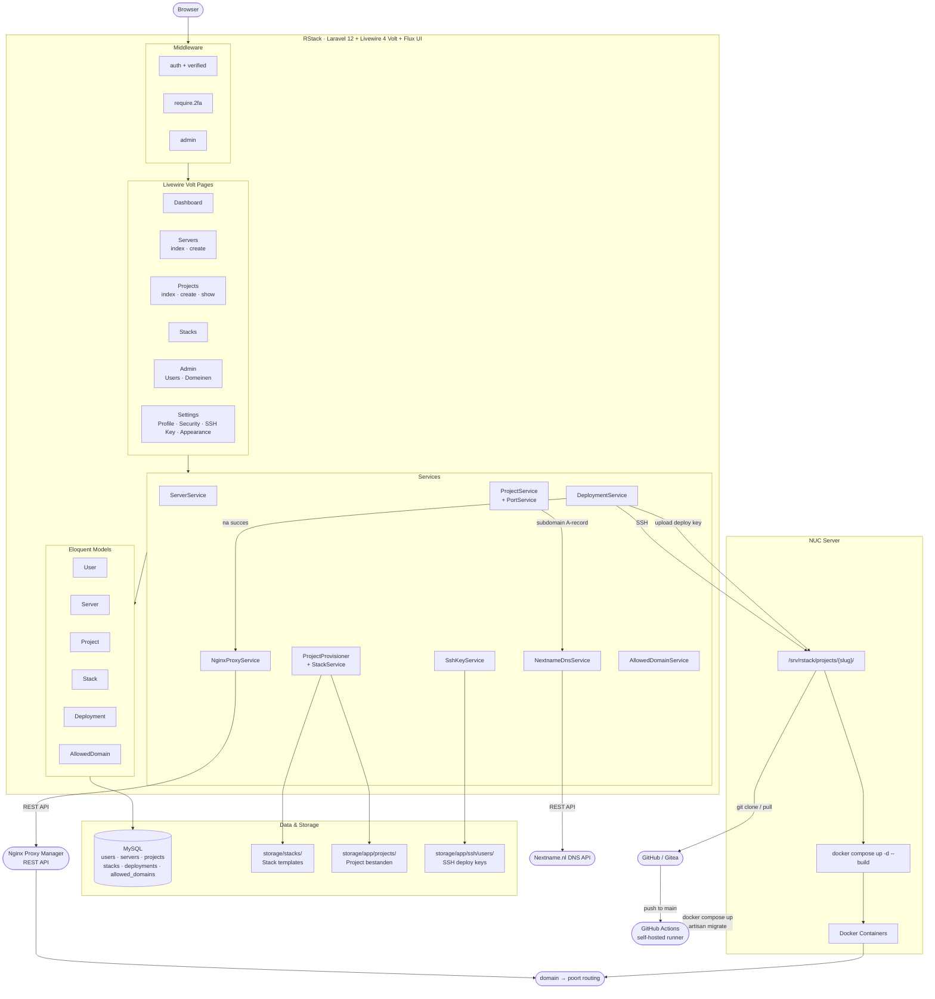

# RStack

Self-hosted deployment platform voor Docker applicaties — vergelijkbaar met Laravel Forge of Coolify.
Beheer je eigen servers, definieer stack-templates en deploy applicaties via Docker Compose met automatisch Git-klonen, reverse proxy provisioning en een volledig CI/CD-pipeline.

**Stack:** Laravel 12 · Livewire 4 (Volt) · Flux UI · MySQL 8.4 · Docker · GitHub Actions

---

## Functieoverzicht

| Categorie | Functie |
|-----------|---------|
| **Beveiliging** | Domeingerichte registratie, verplichte 2FA voor gevoelige acties, admin-middleware |
| **Multi-tenancy** | Servers en projecten zijn gescoopt per gebruiker; admins zien alles |
| **Servers** | Docker-hosts toevoegen met SSH-configuratie (alleen admin) |
| **Stacks** | Herbruikbare deployment-templates (Dockerfile + docker-compose.yml + .env.template) |
| **Resource limits** | Elke stack enforceert CPU- en geheugenlimieten via `deploy.resources` |
| **Projecten** | Automatische slug + poorttoewijzing, lokale bestandsprovisioning vanuit template |
| **DNS subdomeinen** | Subdomeinen registreren via Nextname.nl API; automatische A-record + propagatiecheck |
| **Git integratie** | Repository + branch per project; git clone (eerste keer) of git pull bij elke deploy |
| **SSH Deploy keys** | Gebruikers genereren een persoonlijk ed25519-sleutelpaar; publieke sleutel als deploy key op GitHub/Gitea |
| **Deployment** | SSH-verbinding naar server → git pull → `docker compose up -d --build` |
| **Nginx Proxy Manager** | Automatische proxy host provisioning via REST API na succesvolle deploy |
| **CI/CD Pipeline** | GitHub Actions met self-hosted runner op de NUC |
| **Docker** | Multi-stage build (Node 20 + PHP 8.3-fpm), Supervisor, MySQL 8.4 container |

---

## Architectuur



---

## Vereisten

- PHP 8.3+
- Composer
- Node.js 20+ en NPM
- MySQL (productie) of SQLite (development)
- Een of meerdere Linux-servers met Docker en Docker Compose
- `ssh-keygen` beschikbaar op de RStack-server

---

## Installatie

```bash
# 1. Installeer PHP- en JS-afhankelijkheden
composer install
npm install && npm run build

# 2. Omgevingsbestand aanmaken
cp .env.example .env
php artisan key:generate

# 3. Database aanmaken en vullen
php artisan migrate --seed
```

De seeder maakt een admin-gebruiker aan (zie standaard credentials hieronder).

---

## Docker

RStack draait volledig in Docker. De `Dockerfile` gebruikt een multi-stage build:

| Stage | Image | Doel |
|-------|-------|------|
| `node-builder` | `node:20` (Debian) | Composer install (voor flux-vendorpad), `npm install`, `npm run build` |
| Runtime | `php:8.3-fpm` (Debian) | PHP-FPM, Nginx, Supervisor, alle PHP-extensies |

Supervisor beheert twee processen: `nginx` en `php-fpm`.
Nginx communiceert met PHP-FPM via TCP (`127.0.0.1:9000`).

### Starten

```bash
docker compose up -d --build
```

De `docker-compose.yml` start:
- **`app`** — RStack op poort 8080
- **`db`** — MySQL 8.4 met health check

Volumes: `rstack-storage` (Laravel storage) en `rstack-mysql` (MySQL data).

### Omgevingsvariabelen

```env
APP_URL=https://deploy.jouwdomein.nl

DB_CONNECTION=mysql
DB_HOST=db
DB_PORT=3306
DB_DATABASE=rstack
DB_USERNAME=rstack
DB_PASSWORD=secret

NPM_ENABLED=true
NPM_URL=http://npm.intern:81
NPM_EMAIL=admin@example.com
NPM_PASSWORD=geheimwachtwoord

NEXTNAME_ENABLED=true
NEXTNAME_API_KEY=jouw-nextname-api-key
NEXTNAME_DOMAIN=rstack.nl
NEXTNAME_TTL=300

RSTACK_SSH_KEY_PATH=/home/rstack/.ssh/id_rsa
RSTACK_REMOTE_PROJECT_ROOT=/srv/rstack/projects
RSTACK_SSH_TIMEOUT=120
```

---

## Beveiliging

### Registratie op uitnodiging (domeinfilter)

Registratie is open maar alleen voor **toegestane e-maildomeinen**.
Een admin beheert de lijst via **Admin → Toegestane domeinen**.

Voorbeeld: voeg `mbouutrecht.nl` toe en iedereen met een `@mbouutrecht.nl` adres kan zich registreren.

### Verplichte 2FA

Servers en projecten toevoegen vereist ingeschakelde 2FA.
Zonder 2FA wordt de gebruiker doorgestuurd naar **Instellingen → Beveiliging**.

### Admin-paneel

Zichtbaar in de sidebar voor gebruikers met `is_admin = true`.

| Sectie | Functie |
|--------|---------|
| **Admin → Gebruikers** | Overzicht met 2FA-status, rollen, server-/projecttelling; admin-rechten verlenen/intrekken |
| **Admin → Toegestane domeinen** | Domeinen toevoegen en verwijderen |

### Multi-tenancy

Elk authenticated gebruiker ziet alleen zijn eigen servers en projecten.
Admins zien alles. Servers kunnen alleen door admins worden aangemaakt en verwijderd.

---

## SSH-configuratie

### Platform SSH-sleutel (server-verbinding)

RStack verbindt via SSH met Docker-hosts om deployments uit te voeren.

```env
RSTACK_SSH_KEY_PATH=/home/rstack/.ssh/id_rsa
RSTACK_REMOTE_PROJECT_ROOT=/srv/rstack/projects
RSTACK_SSH_TIMEOUT=120
```

De bijbehorende **publieke sleutel** moet aanwezig zijn in `~/.ssh/authorized_keys` op elke beheerde server.

### Persoonlijke SSH deploy keys (git repositories)

Elke gebruiker kan een persoonlijk ed25519-sleutelpaar genereren via **Instellingen → SSH Key**.

- De **privésleutel** wordt opgeslagen in `storage/app/ssh/users/{id}/id_ed25519` (mode 600)
- De **publieke sleutel** wordt op de instellingspagina getoond met een kopieerknop
- Bij een deploy met een gekoppelde repository wordt de privésleutel automatisch geüpload naar de NUC en gebruikt als `GIT_SSH_COMMAND`

**Deploy key toevoegen:**

| Platform | Pad |
|----------|-----|
| GitHub | Repository → Settings → Deploy keys → Add deploy key |
| Gitea | Repository → Settings → Deploy Keys → Add Key |
| GitLab | Repository → Settings → Repository → Deploy keys |

---

## Servers toevoegen

1. Activeer 2FA (vereist)
2. Ga naar **Servers → Server toevoegen**
3. Vul naam, IP-adres, SSH-gebruiker en poort in
4. Zorg dat de platform SSH-sleutel van RStack toegang heeft tot de server

---

## Stack-templates

Templates staan in `storage/stacks/{naam}/`. Elke template bevat:

```
Dockerfile
docker-compose.yml
nginx.conf            (aanwezig bij laravel en static)
supervisord.conf      (aanwezig bij laravel)
.env.template         (variabelen die automatisch worden ingevuld)
```

### Meegeleverde templates

| Stack | Runtime | Database | CPU | Geheugen | Omschrijving |
|-------|---------|----------|-----|----------|--------------|
| `laravel` | PHP 8.3-fpm-alpine + Nginx (multi-stage) | MySQL 8.4 | 0.75 | 512M | Laravel applicatie met Vite asset build |
| `node` | Node 20 Alpine | — | 0.50 | 256M | Node.js applicatie, draait als niet-root gebruiker |
| `static` | Nginx Alpine | — | 0.25 | 64M | Statische website / SPA met client-side routing |
| `php` | PHP 8.3-fpm-alpine + Nginx | — | 0.50 | 256M | Plain PHP applicatie met OPcache, Supervisor |

### Template details per stack

#### laravel

- **Multi-stage build** — `node:20-alpine` bouwt JS assets, `php:8.3-fpm-alpine` is de runtime
- **Supervisor** beheert nginx + php-fpm
- **MySQL 8.4** met healthcheck; app wacht op `condition: service_healthy`
- **Storage volume** voor logs, sessies en uploads (overleeft container restarts)
- **`HEALTHCHECK`** op `/up` (Laravel health endpoint)
- **Nginx security headers** — `X-Frame-Options`, `X-Content-Type-Options`, `X-XSS-Protection`, `Referrer-Policy`, `server_tokens off`, `fastcgi_hide_header X-Powered-By`
- **`APP_DEBUG=false`** standaard; `LOG_CHANNEL=stderr`

#### node

- **`USER node`** — container draait nooit als root
- **`npm ci --omit=dev`** — geen dev dependencies in productie
- **`HEALTHCHECK`** op `/health`

#### static

- Eigen **nginx.conf** met security headers + lange-termijn asset caching
- Verwijdert `Dockerfile`, `.env` en `nginx.conf` automatisch uit de HTML root tijdens build

#### php

- **PHP 8.3-fpm-alpine** + Nginx als reverse proxy, Supervisor beheert beide processen
- **OPcache** ingeschakeld voor hogere performance
- Geen database-container; geschikt voor eenvoudige PHP-applicaties en scripts
- CPU-limiet 0.50 / geheugen 256M

### Eigen template toevoegen

1. Maak een map `storage/stacks/{naam}/`
2. Voeg `Dockerfile`, `docker-compose.yml` en `.env.template` toe
3. Voeg de stack toe via de database of seeder
4. De template is direct beschikbaar bij het aanmaken van een project

---

## Projecten aanmaken

1. Activeer 2FA (vereist)
2. Ga naar **Projects → Project toevoegen**
3. Kies een server en een stack
4. Vul naam, domein, subdomain (optioneel), git repository (optioneel), branch en omgevingsvariabelen in
5. RStack maakt automatisch:
   - Een unieke slug en poortnummer (startend bij 8001)
   - Een projectmap (`storage/app/projects/{slug}/`) met een kopie van de stack-template
   - Een `.env`-bestand met platform- en gebruikersvariabelen
   - Een DNS A-record bij Nextname.nl (als een subdomain is ingevuld en `NEXTNAME_ENABLED=true`)

---

## Deployment

Deployment flow via `DeploymentService::deploy()`:

1. Project moet status `ready` hebben
2. Deployment-record aangemaakt met status `running`
3. SSH-verbinding naar de server
4. Als een repository is gekoppeld:
   - **Eerste keer:** `git clone --branch {branch} {repository} /srv/rstack/projects/{slug}/`
   - **Vervolgens:** `git pull origin {branch}`
   - Als de gebruiker een SSH deploy key heeft, wordt deze automatisch geüpload en gebruikt
5. `docker compose up -d --build`
6. Log opgeslagen (stdout + stderr)
7. Bij **succes:** status `deployed` + timestamp, project → `running`; NPM proxy host aangemaakt/bijgewerkt
8. Bij **fout:** status `failed` + foutmelding in log, project → `failed`

---

## Nginx Proxy Manager

Na een succesvolle deploy provisiont RStack automatisch een proxy host in Nginx Proxy Manager.

```env
NPM_ENABLED=true
NPM_URL=http://npm.intern:81
NPM_EMAIL=admin@example.com
NPM_PASSWORD=geheimwachtwoord
```

`NginxProxyService` regelt: authenticatie → bestaande host zoeken → aanmaken of bijwerken.
Een NPM-fout rolt de deployment **niet** terug — alleen een waarschuwing wordt gelogd.

---

## DNS subdomeinen (Nextname.nl)

RStack kan automatisch DNS A-records registreren voor projecten via de JSON REST API van Nextname.nl.

### Configuratie

```env
NEXTNAME_ENABLED=true
NEXTNAME_API_KEY=jouw-nextname-api-key
NEXTNAME_DOMAIN=rstack.nl
NEXTNAME_TTL=300
```

### Hoe het werkt

1. Bij het aanmaken van een project vul je een **subdomain** in (bijv. `myapp`)
2. RStack maakt automatisch een A-record aan: `myapp.rstack.nl → server IP`
3. De `dns_status` van het project wordt ingesteld op `pending`
4. Via de projectlijst is er een **Check DNS**-knop om propagatie te controleren
5. Zodra het subdomain resolveert naar het juiste IP wordt `dns_status` bijgewerkt naar `active`

### Artisan command (productiecontrole)

```bash
# Check alle pending subdomeinen
php artisan rstack:check-dns

# Check één specifiek project
php artisan rstack:check-dns --project=myapp

# Check alle projecten (ook active)
php artisan rstack:check-dns --all

# Check én vraag meteen SSL aan via NPM zodra DNS actief is
php artisan rstack:check-dns --ssl
```

Output: tabel met project, slug, FQDN, server IP en DNS-status.

> **Subdomain-regels:** alleen kleine letters, cijfers en koppeltekens; max 63 tekens; mag niet beginnen of eindigen met een koppelteken. Uniek per RStack-installatie.

---

## CI/CD Pipeline

`.github/workflows/deploy.yml` — trigger: `push` naar `main`

**Runner:** self-hosted (NUC)

Stappen:
1. `git pull`
2. `docker compose up -d --build`
3. `php artisan migrate --force`
4. Config, route en view cache vernieuwen

---

## Database

| Tabel | Inhoud |
|-------|--------|
| `users` | Gebruikers, `is_admin`, 2FA-velden, `ssh_public_key`, `ssh_key_fingerprint` |
| `servers` | Docker-hosts (`ip_address`, `ssh_user`, `ssh_port`, `status`) |
| `stacks` | Deployment-templates (`slug`, `template_path`) |
| `projects` | Applicaties (`slug`, `domain`, `subdomain`, `dns_status`, `port`, `repository`, `branch`, `status`, `env_vars`) |
| `deployments` | Deploy-runs (`status`, `log`, `deployed_at`) |
| `allowed_domains` | Toegestane e-maildomeinen voor registratie |

---

## Services

| Service | Verantwoordelijkheid |
|---------|---------------------|
| `ServerService` | Server CRUD (gescoopt op ingelogde gebruiker; admin ziet alles) |
| `ProjectService` | Project CRUD, atomische slug + poorttoewijzing (DB-transactie), DNS-hooks |
| `PortService` | Automatische poorttoewijzing (start bij poort 8001) |
| `ProjectProvisioner` | Lokale bestandssysteem-provisioning (template kopiëren, `.env` schrijven) |
| `StackService` | Stack CRUD + template-validatie |
| `DeploymentService` | SSH-verbinding, git clone/pull, Docker, deployment-lifecycle |
| `NginxProxyService` | NPM REST API: proxy host aanmaken/bijwerken/verwijderen |
| `NextnameDnsService` | Nextname.nl REST API: A-record aanmaken/verwijderen, DNS-propagatiecheck |
| `SshKeyService` | ed25519-sleutelpaar genereren, publieke sleutel opslaan in DB |
| `AllowedDomainService` | Beheer van toegestane registratiedomeinen |

---

## Standaard gebruiker (seeder)

| E-mail | Wachtwoord | Rol |
|--------|------------|-----|
| `test@example.com` | `password` | Admin |

### Handmatig gebruiker aanmaken

```bash
php artisan tinker
```

```php
App\Models\User::create([
    'name'     => 'Naam',
    'email'    => 'email@example.com',
    'password' => bcrypt('wachtwoord'),
    'is_admin' => false,
]);
```

### Admin-rechten toekennen

```php
App\Models\User::where('email', 'jouw@email.com')->update(['is_admin' => true]);
```

Of via de interface: **Admin → Gebruikers → Admin maken**

Een admin beheert de lijst via **Admin → Toegestane domeinen**.

Voorbeeld: voeg `mbouutrecht.nl` toe en iedereen met een `@mbouutrecht.nl` adres kan zich registreren.
Onbekende domeinen worden geweigerd.

### Two-factor authenticatie (2FA) verplicht

Om servers en projecten toe te voegen moet een gebruiker **2FA ingeschakeld hebben**.
Zonder 2FA wordt de gebruiker automatisch doorgestuurd naar de beveiligingsinstellingen.

2FA instellen: **Instellingen → Beveiliging → Two-factor authenticatie**

### Standaard testgebruiker (seeder)

| E-mail           | Wachtwoord | Rol   |
|------------------|------------|-------|
| test@example.com | password   | Admin |

### Handmatig gebruiker aanmaken

```bash
php artisan tinker
```

```php
App\Models\User::create([
    'name'     => 'Naam',
    'email'    => 'email@example.com',
    'password' => bcrypt('wachtwoord'),
    'is_admin' => false, // true voor beheerderstoegang
]);
```

### Admin-rechten toekennen aan bestaande gebruiker

Via Tinker:

```bash
php artisan tinker
```

```php
App\Models\User::where('email', 'jouw@email.com')->update(['is_admin' => true]);
```

Of via de interface: **Admin → Gebruikers → Admin maken**

---

## Admin-paneel

Het admin-paneel is zichtbaar in de sidebar voor gebruikers met `is_admin = true`.

### Gebruikers beheren (Admin → Gebruikers)

Overzicht van alle gebruikers met per gebruiker:

| Kolom | Inhoud |
|-------|--------|
| Naam + e-mail | Identiteit en initialen-avatar |
| 2FA | Aan / Uit status |
| Rol | Admin of Gebruiker |
| Servers | Aantal servers in beheer |
| Projects | Totaal projecten |
| Running | Actief draaiende projecten |
| Failed | Gefaalde projecten |
| Lid sinds | Relatieve tijd |
| Actie | Admin-rechten toekennen of intrekken |

### Toegestane domeinen (Admin → Toegestane domeinen)

Beheer welke e-maildomeinen zich mogen registreren.
Voeg een domein toe met een optionele omschrijving. Verwijderen kan direct vanuit de lijst.

---

## SSH-configuratie

RStack verbindt via SSH met Docker-servers om deployments uit te voeren.
Stel de volgende waarden in via `.env`:

```env
RSTACK_SSH_KEY_PATH=/home/user/.ssh/id_rsa
RSTACK_REMOTE_PROJECT_ROOT=/srv/rstack/projects
RSTACK_SSH_TIMEOUT=120
```

| Variabele | Omschrijving | Standaard |
|-----------|-------------|-----------|
| `RSTACK_SSH_KEY_PATH` | Pad naar de privésleutel | `storage/app/ssh/id_rsa` |
| `RSTACK_REMOTE_PROJECT_ROOT` | Basismap voor projectbestanden op de server | `/srv/rstack/projects` |
| `RSTACK_SSH_TIMEOUT` | SSH-time-out in seconden | `120` |

De bijbehorende **publieke sleutel** moet aanwezig zijn in `~/.ssh/authorized_keys` op elke beheerde server.

---

## Servers toevoegen

> **Let op:** alleen admins kunnen servers toevoegen en verwijderen.

1. Activeer 2FA (vereist)
2. Ga naar **Servers → Server toevoegen**
3. Vul naam, IP-adres, SSH-gebruiker en poort in
4. Zorg dat de SSH-sleutel van RStack toegang heeft tot de server

---

## Tests

De testsuite draait volledig in-memory (SQLite) en is opgesplitst in:

```bash
php artisan test
# of gefiltered:
php artisan test --filter=NextnameDnsServiceTest
php artisan test --filter=SubdomainValidation
```

### Overzicht testbestanden

| Bestand | Tests | Dekt |
|---------|-------|------|
| `tests/Feature/NextnameDnsServiceTest.php` | 16 | `enabled()`, `register()`, `remove()`, `checkPropagation()`, `fqdn()` — inclusief `Http::fake()` |
| `tests/Feature/Projects/SubdomainValidationTest.php` | 14 | Subdomain-format validatie, uniekheidsregel |
| `tests/Feature/Auth/*` | 13 | Login, registratie, 2FA, e-mailverificatie, wachtwoord reset |
| `tests/Feature/DashboardTest.php` | 2 | Dashboard toegankelijkheid |
| `tests/Feature/Settings/*` | 9 | Profiel bijwerken, wachtwoord wijzigen, beveiligingsinstellingen |

### Factories

`ServerFactory`, `StackFactory` en `ProjectFactory` zijn beschikbaar voor gebruik in tests.
`ProjectFactory::withSubdomain(string $subdomain, ?string $dnsStatus = 'pending')` maakt het eenvoudig projecten met subdomain-scenario's aan te maken.
